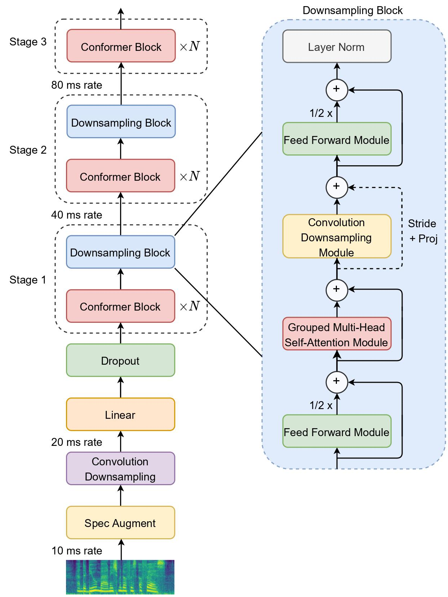
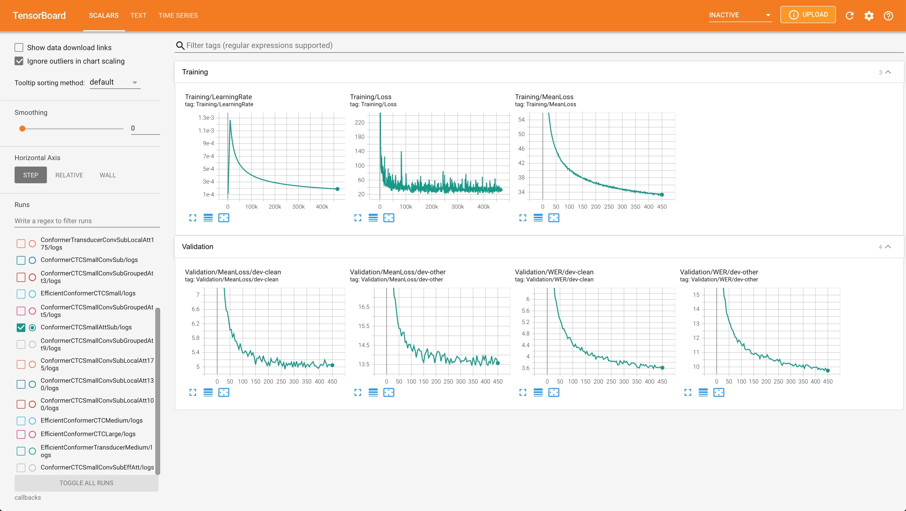

# Efficient Conformer: Progressive Downsampling and Grouped Attention for Automatic Speech Recognition

Official implementation of the Efficient Conformer, progressively downsampled Conformer with grouped attention for Automatic Speech Recognition.

## Efficient Conformer Encoder
Inspired from previous works done in Automatic Speech Recognition and Computer Vision, the Efficient Conformer encoder is composed of three encoder stages where each stage comprises a number of Conformer blocks using grouped attention. The encoded sequence is progressively downsampled and projected to wider feature dimensions, lowering  the amount of computation while achieving better performance. Grouped multi-head attention reduce attention complexity by grouping neighbouring time elements along the feature dimension before applying scaled dot-product attention.



## Installation
Clone GitHub repository and set up environment
```
git clone https://github.com/burchim/EfficientConformer.git
cd EfficientConformer
pip install -r requirements.txt
```

Install [ctcdecode](https://github.com/parlance/ctcdecode)

## Download LibriSpeech

[Librispeech](https://www.openslr.org/12) is a corpus of approximately 1000 hours of 16kHz read English speech, prepared by Vassil Panayotov with the assistance of Daniel Povey. The data is derived from read audiobooks from the LibriVox project, and has been carefully segmented and aligned.

```
cd datasets
./download_LibriSpeech.sh
```

## Running an experiment

You can run an experiment by providing a config file using the '--config_file' flag. Training checkpoints and logs will be saved in the callback folder specified in the config file. Note that '--prepare_dataset' and '--create_tokenizer' flags may be needed for your first experiment.

```
python main.py --config_file configs/config_file.json
```

## Evaluation

Models can be evaluated by selecting a subset validation/test mode and by providing the epoch/name of the checkpoint to load for evaluation with the '--initial_epoch' flag. The '--gready' flag designates whether to use gready search or beam search decoding for evaluation.

```
python main.py --config_file configs/config_file.json --initial_epoch epoch/name --mode validation/test --gready
```

## Options


```
-c / --config_file		type=str   default="configs/EfficientConformerCTCSmall.json"	help="Json configuration file containing model hyperparameters"
-m / --mode                	type=str   default="training"                               	help="Mode : training, validation-clean, test-clean, eval_time-dev-clean, ..."
-d / --distributed         	action="store_true"                                            	help="Distributed data parallelization"
-i / --initial_epoch  		type=str   default=None                                       	help="Load model from checkpoint"
--initial_epoch_lm         	type=str   default=None                                       	help="Load language model from checkpoint"
--initial_epoch_encoder    	type=str   default=None                                       	help="Load model encoder from encoder checkpoint"
-p / --prepare_dataset		action="store_true"                                            	help="Prepare dataset before training"
-j / --num_workers        	type=int   default=8                                          	help="Number of data loading workers"
--create_tokenizer         	action="store_true"                                            	help="Create model tokenizer"
--batch_size_eval      		type=int   default=8                                          	help="Evaluation batch size"
--verbose_val              	action="store_true"                                            	help="Evaluation verbose"
--val_steps                	type=int   default=None                                       	help="Number of validation steps"
--steps_per_epoch      		type=int   default=None                                       	help="Number of steps per epoch"
--world_size               	type=int   default=torch.cuda.device_count()                  	help="Number of available GPUs"
--cpu                      	action="store_true"                                            	help="Load model on cpu"
--show_dict            		action="store_true"                                            	help="Show model dict summary"
--swa                      	action="store_true"                                            	help="Stochastic weight averaging"
--swa_epochs               	nargs="+"   default=None                                       	help="Start epoch / end epoch for swa"
--swa_epochs_list      		nargs="+"   default=None                                       	help="List of checkpoints epochs for swa"
--swa_type                   	type=str   default="equal"                                    	help="Stochastic weight averaging type (equal/exp)"
--parallel                   	action="store_true"                                            	help="Parallelize model using data parallelization"
--rnnt_max_consec_dec_steps  	type=int   default=None                                       	help="Number of maximum consecutive transducer decoder steps during inference"
--eval_loss                  	action="store_true"                                            	help="Compute evaluation loss during evaluation"
--gready                     	action="store_true"                                            	help="Proceed to a gready search evaluation"
--saving_period              	type=int   default=1                                          	help="Model saving every 'n' epochs"
--val_period                 	type=int   default=1                                          	help="Model validation every 'n' epochs"
--profiler                   	action="store_true"                                            	help="Enable eval time profiler"
```

## Monitor training

```
tensorboard --logdir callback_path
```



## LibriSpeech Performance

| Model        			| Size     	| Type  | Params (M) | test-clean/test-other gready WER (%)| test-clean/test-other n-gram WER (%) | GPUs |
| :-------------------:	|:--------:	|:-----:|:----------:|:------:|:------:|:------:|
| [Efficient Conformer](https://drive.google.com/drive/folders/1Dqu1RTHQ8jxGxEPar2-WMjR0hRhmkpoU?usp=sharing)	| Small		| CTC 	| 13.2  | 3.6 / 9.0 | 2.7 / 6.7 | 4 x RTX 2080 Ti |
| [Efficient Conformer](https://drive.google.com/drive/folders/1uaDQWdZZEfq8sbq0u8w6hnFpUqEyjH9S?usp=sharing)	| Medium	| CTC 	| 31.5  | 3.0 / 7.6 | 2.4 / 5.8 | 4 x RTX 2080 Ti |
| [Efficient Conformer](https://drive.google.com/drive/folders/1NyxiVNsR7qyLGeIYMOchu9JPiTLFlsoj?usp=sharing)	| Large 	| CTC 	| 125.6 | 2.5 / 5.8 | 2.1 / 4.7 | 4 x RTX 3090 |

## Reference
[Maxime Burchi, Valentin Vielzeuf.	Efficient Conformer: Progressive Downsampling and Grouped Attention for Automatic Speech Recognition.](https://hal.archives-ouvertes.fr/hal-03328716)
<br><br>


## Author
* Maxime Burchi [@burchim](https://github.com/burchim)
* Contact: [maxime.burchi@gmail.com](mailto:maxime.burchi@gmail.com)
